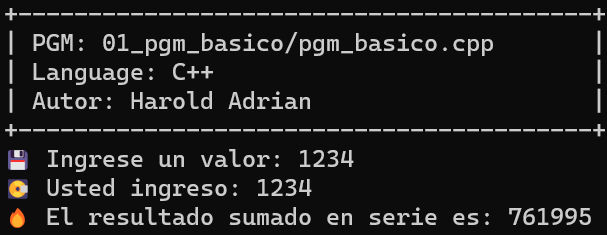

# First PGM on C++

## How Build a C++'s Program

|Programming Actions       |Commands                                                                      |
|--------------------------|------------------------------------------------------------------------------|
|Make a output bin folder  |~$> `mkdir c++/01_pgm_basico/bin`                                             |
|Compile program           |~$> `g++ -o c++/01_pgm_basico/bin/pgm_basico c++/01_pgm_basico/pgm_basico.cpp`|

## Programs

### Performing 01_pgm_basico/bin/pgm_basico
